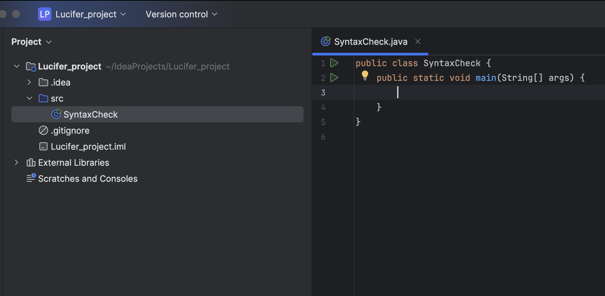
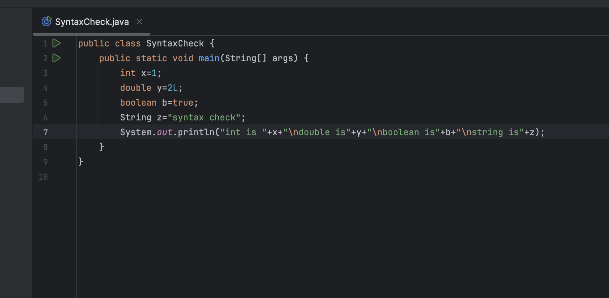
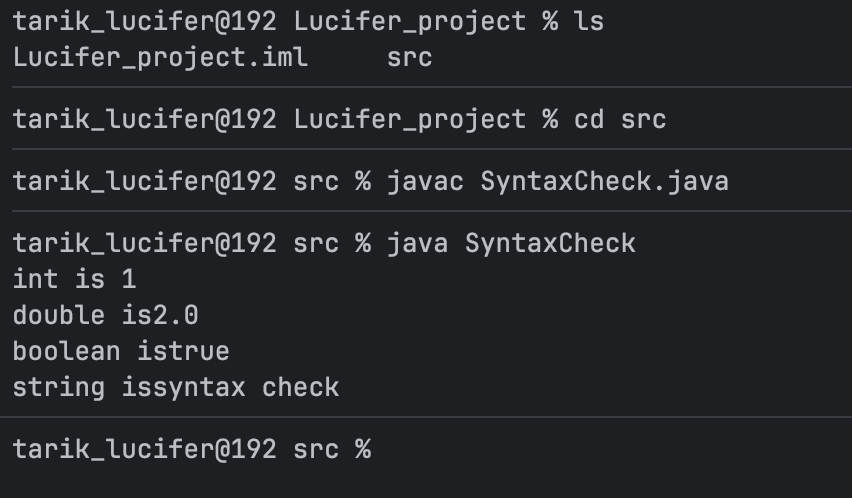

# Java #2 Explore Java Syntax & Variables

**goals**:

- Create a new class `SyntaxCheck.java`.
- Declare variables of different types: `int`, `double`, `String`, `boolean`.
- Assign values and print them to the console.
- Use string concatenation in the output.
- Test compilation and execution via CLI:
    - `javac SyntaxCheck.java`
    - `java SyntaxCheck`
- Expected output: Display all variable values clearly !

### Create a new class `SyntaxCheck.java`

1. first of all lets create our class
2. and lets go for next steps
    
    
    

ive write the main class here to test every thing

### Declare variables of different types: `int`, `double`, `String`, `boolean`.

- Assign values and print them to the console.
- Use string concatenation in the output.
- Test compilation and execution via CLI:
    - `javac SyntaxCheck.java`
    - `java SyntaxCheck`

this is what we got:

and lets go for results:

Open ur CLI and go for compilation and execution

and with this we fixed all our goals