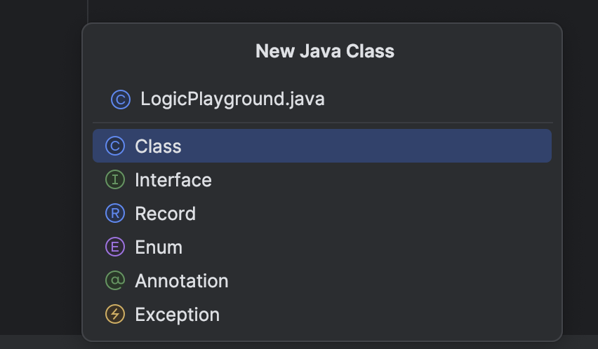
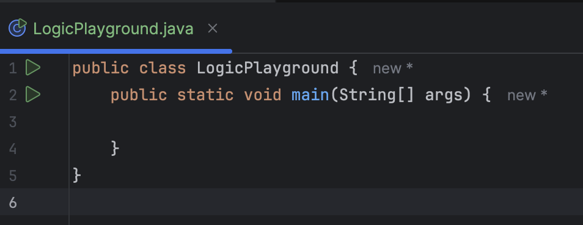
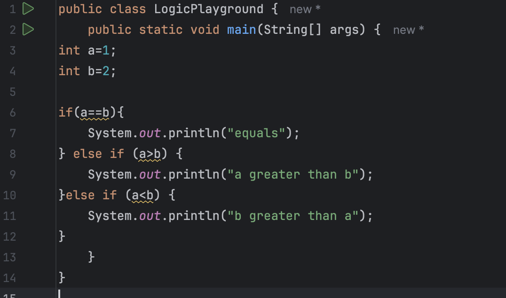
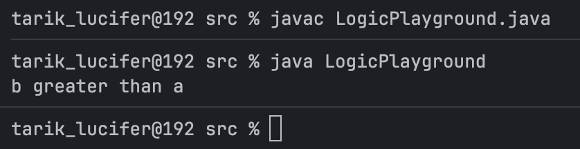
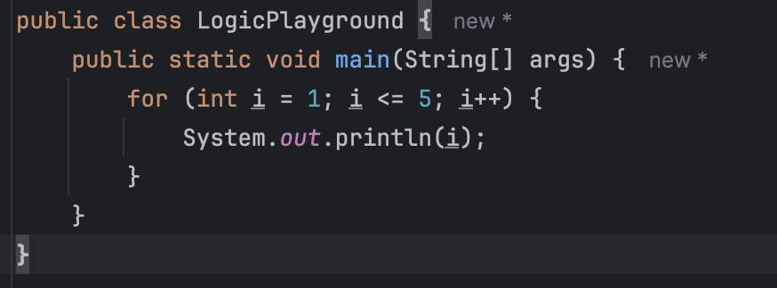
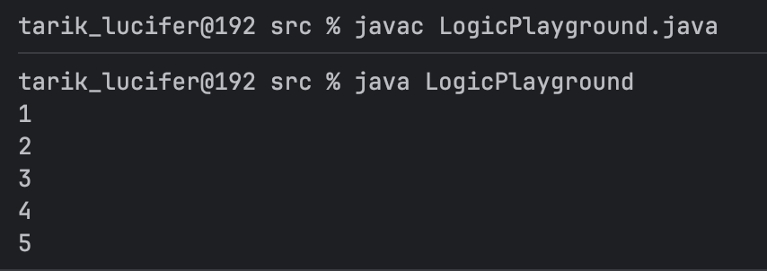
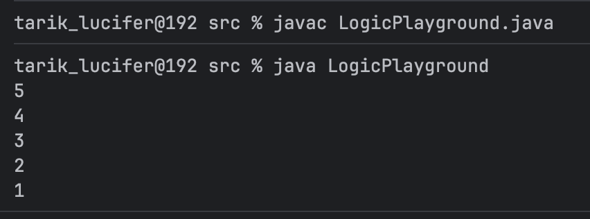

# Java #3 Implement Conditional Logic & Loops

- Create a new class `LogicPlayground.java.`
- Implement:
    - An **`if-else`** statement that compares two integers.
    - A **`for loop`** printing numbers from 1 to 5.
    - A **`while loop**` that counts down from 5 to 1.
- Compile and run with CLI:
    - `javac LogicPlayground.java`
    - `java LogicPlayground`
- Expected output: Demonstrate the flow of conditional statements and loops.

### Create a new class LogicPlayground.java.

1. lets create our class 
    
    
    

1. and make the `main()` function in it:

and lets implement:

### An **`if-else`** statement that compares two integers.

we are going to make a if else statement an integer a =1 and another b=2 and we will compare between these two 

and here we go

### A **`for loop`** printing numbers from 1 to 5.

this is the code :

and this is the result

### A **`while` loop** that counts down from 5 to 1.

this is the code

and here we go

all the goals that we talked abt are done