# java #1 Setup your environment & run your first program "Hello Lucifer"

##### Goals:

* Installed JDK 17 (verified with `java -version`).
* Configured `JAVA_HOME` and updated `PATH` to include JDK `bin`.
* Installed IDE (IntelliJ / VS Code) with SDK configured.
* Tested setup via CLI:
  * Compiled with `javac Lucifer.java`
  * Executed with `java Lucifer`
* Output successfully displayed: **“Hello Lucifer”**.

### Installed JDK 17 (verified with `java -version`).

1. go to https://www.oracle.com/java/technologies/javase/jdk17-archive-downloads.html
2. chose the the best version for ur enviroment , for me im using windows 11 desktop

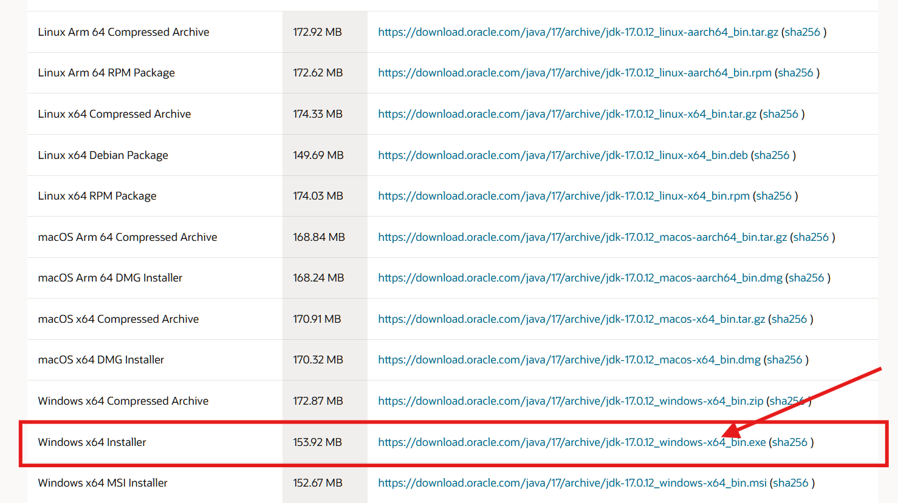

1. install this version by using wizard

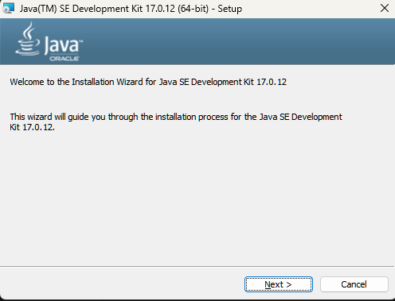

chose ur path

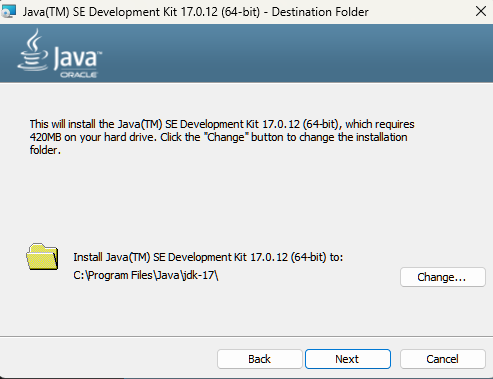

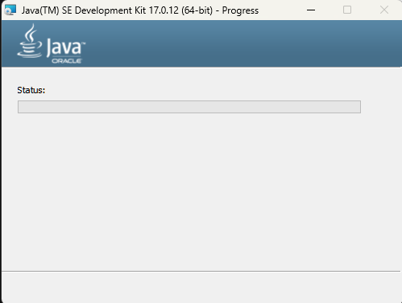

* our first goal is done : Installed JDK 17 ✅

### Configured `JAVA_HOME` and updated `PATH` to include JDK `bin`.

1. lets configure `JAVA_HOME`: search environnement on search bar:

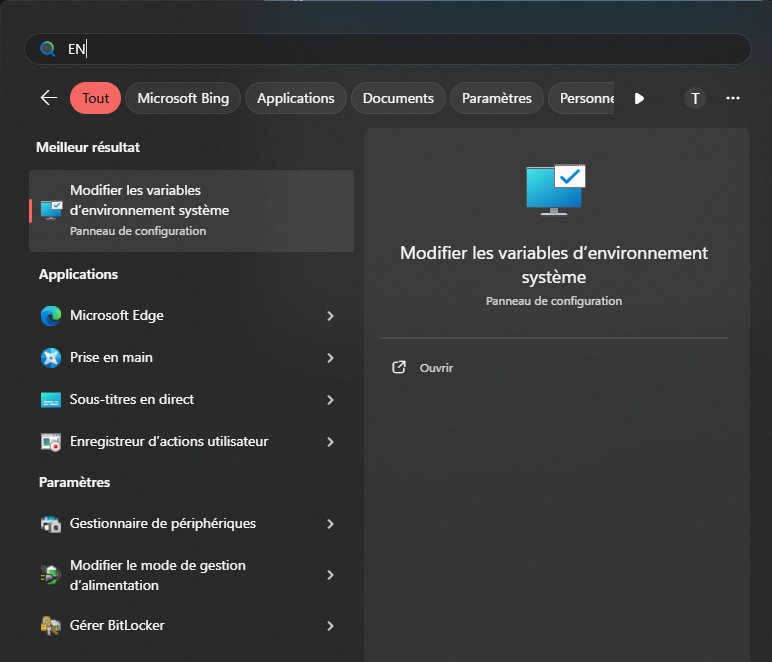

1. chose environnement variables:

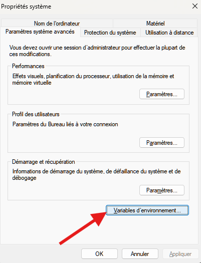

1. we should now add `JAVA_HOME` to system variables in order to all the users (including IDE can use it)

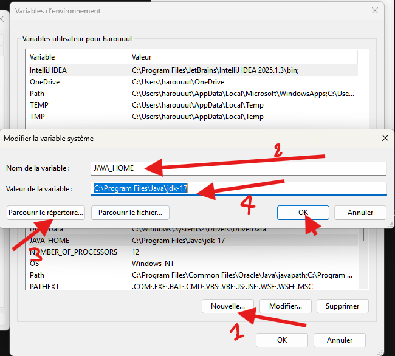

1. lets update `PATH` to include JDK `bin`.

in the same place lets find path

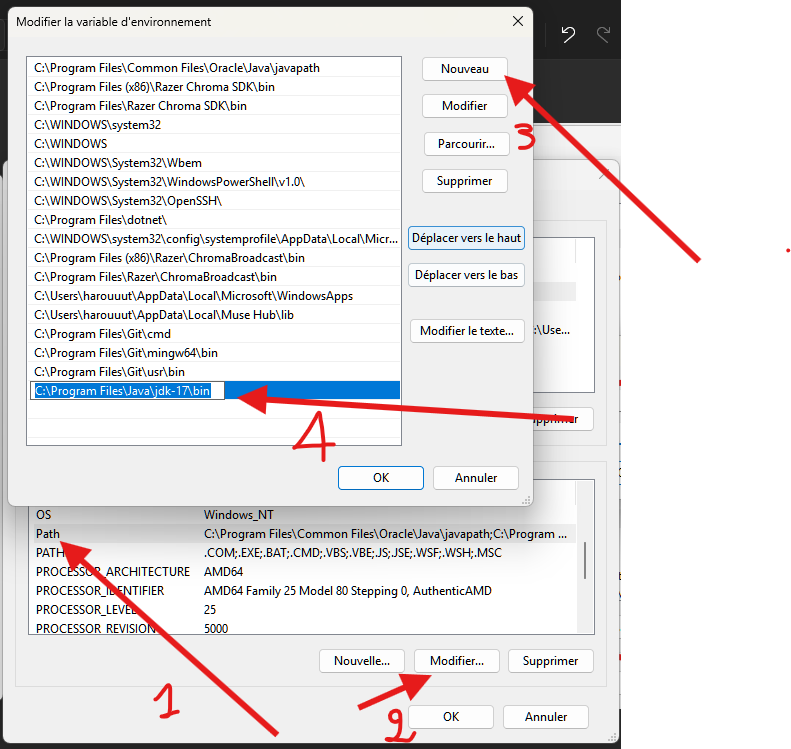

1. and here we go: now lets test it with java 

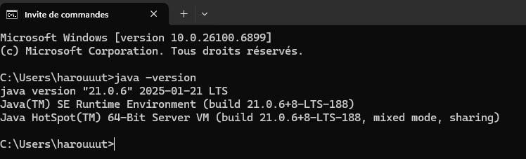

* our second goal is done : Configured `JAVA_HOME` and updated `PATH` to include JDK `bin`✅

### Installed IDE (IntelliJ / VS Code) with SDK configured.

1. go to https://www.jetbrains.com/idea/download/?section=windows

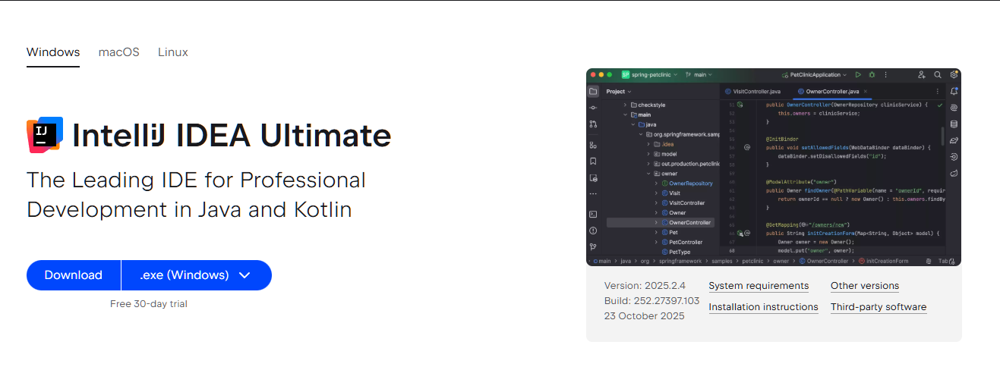

and download it

1. and install it using the wizard:

1. lets create a project named lucifer

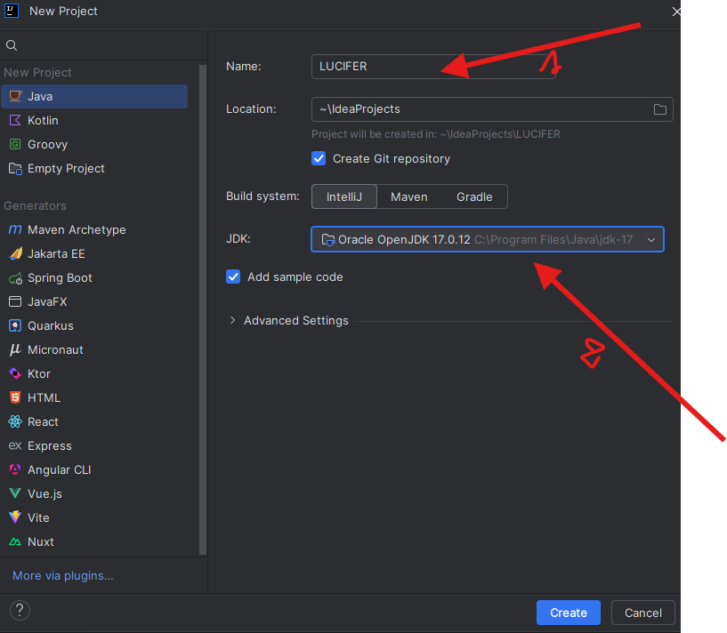

and chose our JDK and click create 

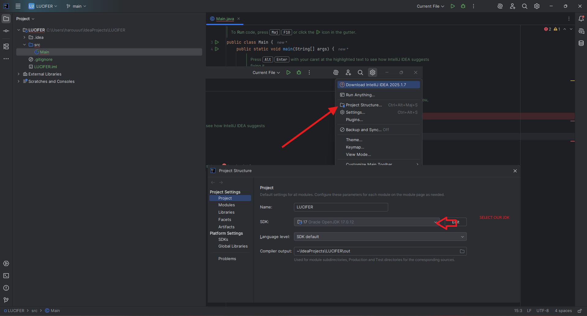

after this we should change our SDK if is not set

### Output successfully displayed: **“Hello Lucifer”**.

1. now we start coding

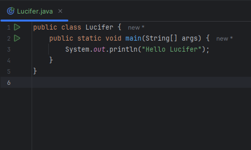

1. lets make some things with java CLI

like compiling to bytecode and executing the program:

After all this we did it all our goals sets are done ✅

